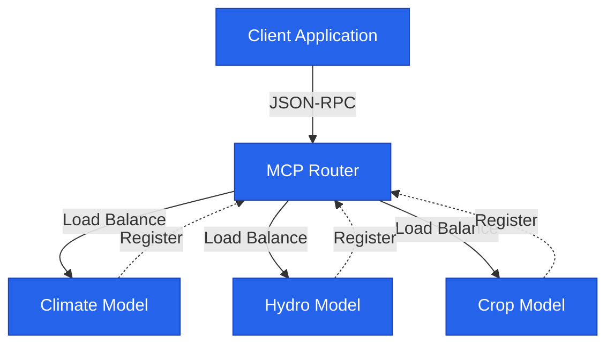

# SDK Overview

The MCP Node SDK provides the foundation for building composable scientific models that integrate seamlessly with the MCP-Sim platform.

_Install with `pip install mcp-node-sdk`._

## Core Concepts

### ModelNode

The `ModelNode` class is the base for all MCP models. It handles:

- **JSON-RPC Protocol** — Standardized request/response format
- **Auto-registration** — Connects to router on startup
- **Health monitoring** — Built-in health check endpoints
- **Error handling** — Consistent error responses

```python
from mcp_node_sdk import ModelNode

class MyModel(ModelNode):
    def __init__(self):
        super().__init__(
            model_id="my_model_v1",
            version="1.0.0",
            description="My scientific model"
        )
# We recommend loading these fields from metadata.json in production, as shown in the Quick Start guide.
```

### @capability Decorator

Capabilities are the functions your model exposes via the API.

```python
from mcp_node_sdk import capability

@capability("predict_yield")
async def predict_yield(self, ctx):
    # Your model logic here
    return {"yield_tons": 42.5}
```
> The `@capability` decorator automatically attaches input/output schemas (from type hints or Pydantic models) for validation and documentation.

### ExecutionContext

The `ctx` parameter provides access to request data and utilities:

```python
@capability("simulate")
async def simulate(self, ctx):
    # Input data from the request
    temperature = ctx.input_data["temp_celsius"]
    
    # Request metadata
    request_id = ctx.request_id
    user_id = ctx.user_id
    
    # Logging utilities (SDK injects a structlog or standard logger)
    ctx.log.info(f"Processing request {request_id}")
    
    return {"result": temperature * 1.8 + 32}
```
If you attach a Pydantic schema to your `@capability` decorator, the validated payload is available via `ctx.validated_input`.

### MCPResponse

Standardized response format for all MCP operations:

```python
# Success response
return MCPResponse(success=True, data={"temperature_f": 98.6})

# Error response
return MCPResponse(success=False, error="Temperature must be numeric")
```
> _Note: If your SDK uses static methods like `MCPResponse.success()`, update this snippet accordingly._

## Architecture Diagram



## Advanced Features

### Input Validation

Automatic validation from JSON Schema or Python type hints:

```python
from typing import Optional
from pydantic import BaseModel

class ClimateInputs(BaseModel):
    temperature: float
    humidity: Optional[float] = 0.5
    pressure: float

@capability("forecast")
async def forecast(self, ctx: ExecutionContext[ClimateInputs]):
    inputs = ctx.validated_input  # Automatically validated
    return {"forecast": "sunny"}
```
> The SDK provides a `Generic[InputSchema]` alias for type-safety (optional).

### Async Support

Full async/await support for network I/O operations:

```python
import aiohttp

@capability("fetch_weather")
async def fetch_weather(self, ctx):
    async with aiohttp.ClientSession() as session:
        async with session.get("https://api.weather.com") as resp:
            data = await resp.json()
    return {"weather": data}
```
> If your capability function is synchronous, the SDK will automatically run it in a thread pool so the event loop never blocks.

### Error Handling

Built-in error categories with automatic HTTP status mapping:

```python
from mcp_node_sdk.exceptions import ValidationError, ComputeError

@capability("complex_calc")
async def complex_calc(self, ctx):
    try:
        result = expensive_computation(ctx.input_data)
        return {"result": result}
    except ValueError as e:
        raise ValidationError(f"Invalid input: {e}")
    except Exception as e:
        raise ComputeError(f"Calculation failed: {e}")
```

## Best Practices

1. **Keep capabilities focused** — One function, one scientific task
2. **Validate inputs early** — Use type hints and schemas
3. **Handle errors gracefully** — Return meaningful error messages
4. **Log important events** — Use `ctx.log` for debugging
5. **Test thoroughly** — Unit test each capability
6. **Document clearly** — Use docstrings and metadata
7. **Tune `cost_per_call`** — Benchmark execution time and set a fair price for users.

## Next Steps

- **[Schema Specification →](04-schema-spec)**
- **[Local Testing →](05-local-testing)**
- **[Docker Deployment →](06-docker-deploy)**